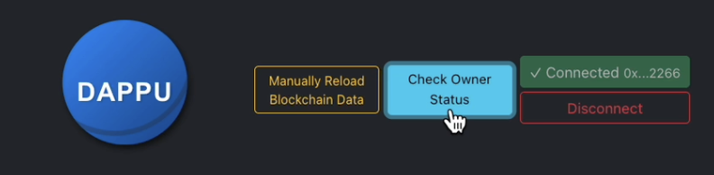
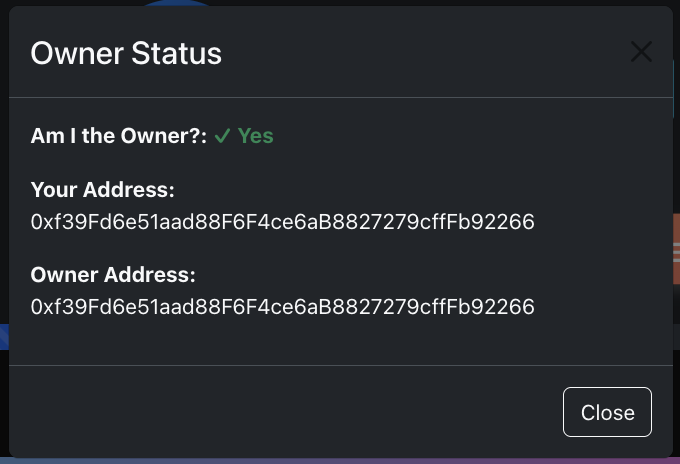
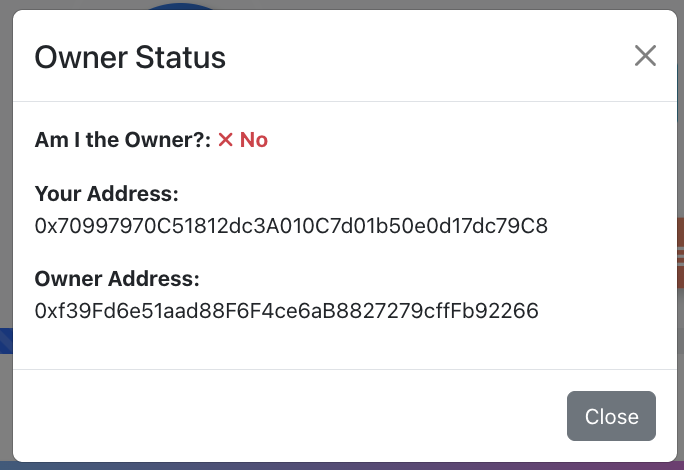
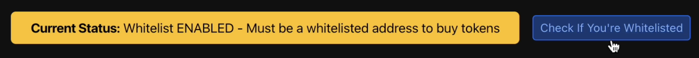
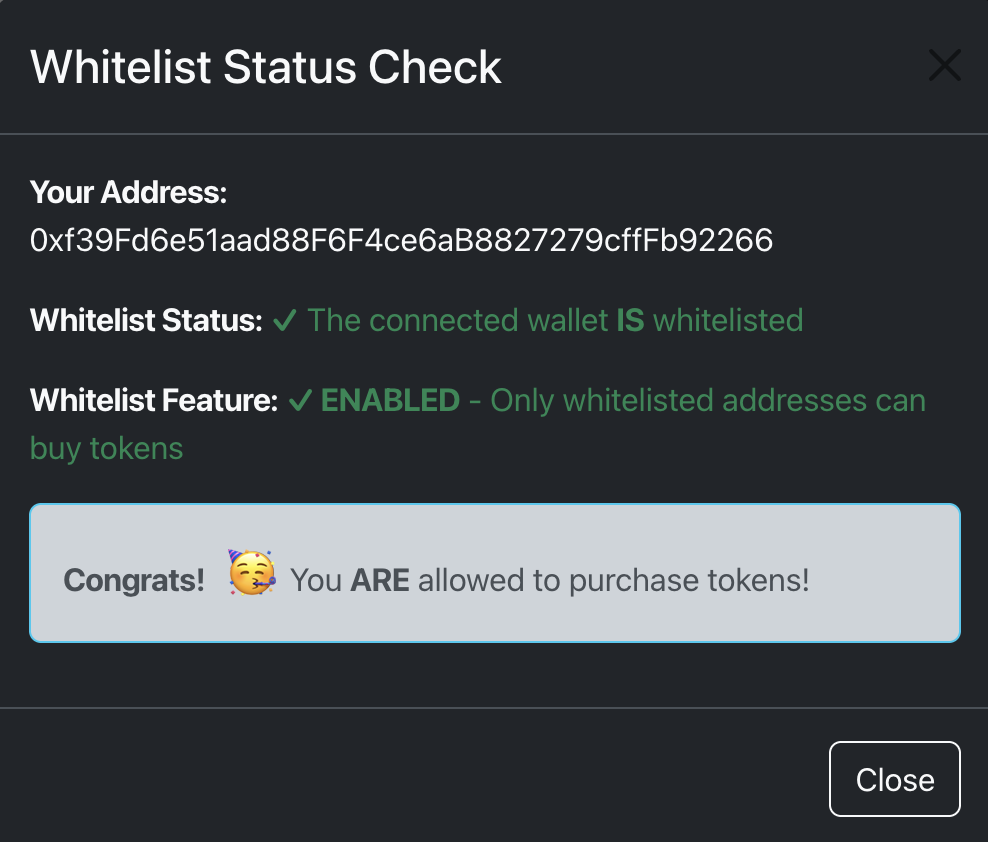
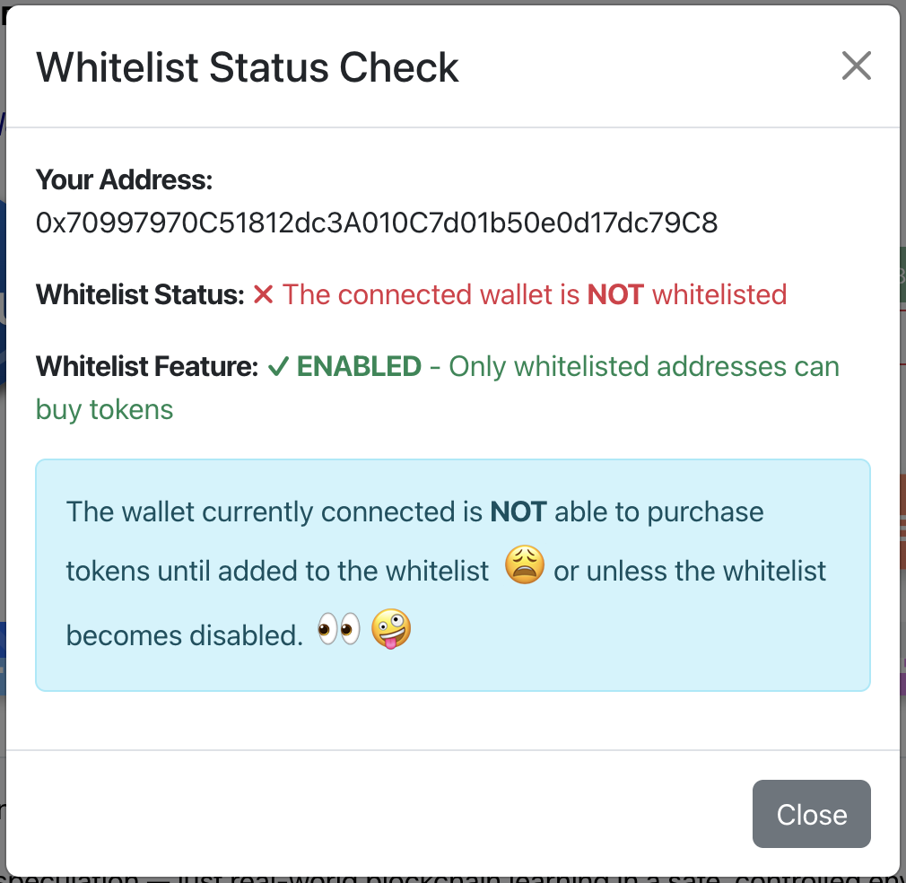
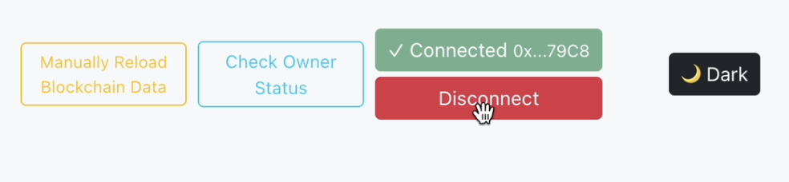
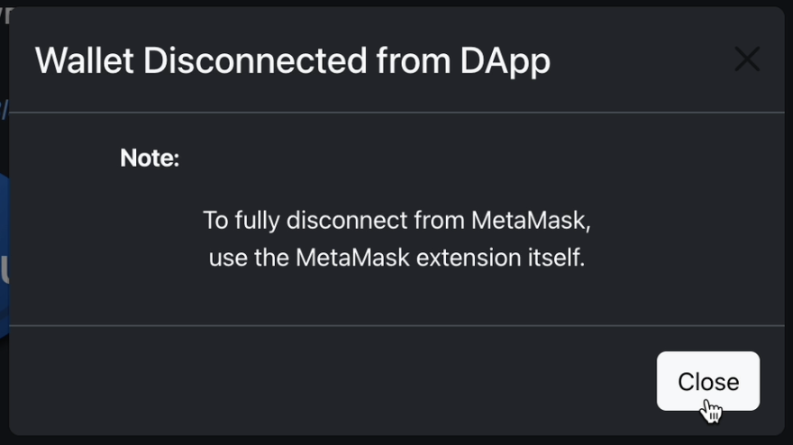

# Modal Components Documentation

## Overview

The DAPPU Crowdsale application uses several modal dialogs to enhance user experience and provide important information without navigating away from the main interface. These modals are implemented using React-Bootstrap's Modal component and are styled to support both light and dark modes.

## Modal Types

### 1. Owner Status Check Modal

**Purpose:** Allows any user to check if their connected wallet is the owner of the crowdsale contract.

**Location:** Triggered from the "Check Owner Status" button in the Navigation bar.

**Features:**
- Displays whether the current wallet is the contract owner
- Shows the current wallet address
- Shows the contract owner's address
- Supports dark mode styling

**Screenshots:**
<div align="center">
  
  <p><em>Owner Status Modal</em></p>
  <br/>
  
  <p><em>Owner Status = Yes <small>- (ref:dark-mode)</small></em></p>
    <br/>
  
  <p><em>Owner Status = No <small>- (ref:light-mode)</small></em></p>
</div>

### 2. Whitelist Status Check Modal

**Purpose:** Allows users to check if their wallet is whitelisted for token purchases.

**Location:** Triggered from the "Check If You're Whitelisted" button.

**Features:**
- Shows whether the user's wallet is whitelisted
- Displays the current status of the whitelist feature (enabled/disabled)
- Provides clear feedback on whether the user can purchase tokens
- Uses color-coded indicators and emojis for better user experience
- Supports dark mode styling

**Screenshots:**
<div align="center">
  
  <p><em>Check if Whitelisted Modal</em></p>
  </br>
  
  <p><em>Yes <small>- (ref:dark-mode)</small></em></p>
  </br>
  
  <p><em>No <small>- (ref:light-mode)</small></em></p>
</div>

### 3. Wallet Disconnection Modal

**Purpose:** Informs users when they disconnect their wallet from the application.

**Location:** Appears after clicking the "Disconnect" button.

**Features:**
- Confirms the wallet has been disconnected from the DApp
- Reminds users that to fully disconnect from MetaMask, they need to use the extension itself
- Supports dark mode styling

**Screenshots:**
<div align="center">
  
  <p><em>Wallet Disconnect Button</em></p>
  </br>
  
  <p><em>Wallet Disconnect Modal</em></p>
</div>

## Implementation Details

### Dark Mode Support

All modals support dark mode through conditional styling:

```jsx
<Modal 
  show={showModal} 
  onHide={() => setShowModal(false)}
  contentClassName={darkMode ? "bg-dark text-light" : ""}
>
  <Modal.Header closeButton className={darkMode ? "bg-dark text-light border-secondary" : ""}>
    <Modal.Title>Modal Title</Modal.Title>
  </Modal.Header>
  <Modal.Body className={darkMode ? "bg-dark text-light" : ""}>
    {/* Modal content */}
  </Modal.Body>
  <Modal.Footer className={darkMode ? "bg-dark border-secondary" : ""}>
    <Button variant={darkMode ? "outline-light" : "secondary"} onClick={() => setShowModal(false)}>
      Close
    </Button>
  </Modal.Footer>
</Modal>
```

### Status Indicators

Status indicators use color-coded text and symbols for better user experience:

```jsx
{/* Example of status indicator */}
<p><strong>Status:</strong> {isActive ? 
  <span className="text-success"><strong>✓ Active</strong></span> : 
  <span className="text-danger"><strong>✗ Inactive</strong></span>}
</p>
```

## Best Practices

1. **Consistent Styling:** All modals follow the same styling pattern for consistency
2. **Dark Mode Support:** All modals adapt to the application's dark/light mode setting
3. **Clear Actions:** Each modal has clear action buttons
4. **Informative Content:** Content is concise and provides valuable information
5. **Visual Indicators:** Uses color and symbols to enhance understanding