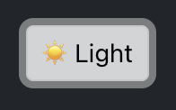

# Dark Mode Implementation

## Overview

The DAPPU Crowdsale application includes a comprehensive dark mode feature that allows users to switch between light and dark themes. This enhances user experience by reducing eye strain in low-light environments and providing a modern, customizable interface.

## Features

- **Toggle Button**: Easy switching between light and dark modes
- **Persistent Styling**: Consistent dark theme across all components
- **Visual Indicators**: Color adjustments for better contrast and readability
- **Animated Transitions**: Smooth transitions between modes

## Implementation

### State Management

Dark mode is implemented using React's useState hook in the App.js component:

```jsx
const [darkMode, setDarkMode] = useState(false);
```

### Toggle Button

A toggle button in the Navigation component allows users to switch between modes:

```jsx
<Button
  variant={darkMode ? "light" : "dark"}
  size="sm"
  className="ms-2"
  onClick={() => setDarkMode(!darkMode)}
>
  {darkMode ? (
    <>
      <span role="img" aria-label="sun" className="me-1">☀️</span>
      <span className="d-none d-md-inline">Light</span>
    </>
  ) : (
    <>
      <span role="img" aria-label="moon" className="me-1">🌙</span>
      <span className="d-none d-md-inline">Dark</span>
    </>
  )}
</Button>
```

### Global Styling

Dark mode is applied to the entire application using a combination of:

1. **Body Class**: A class is added to the body element to enable global dark mode:

```jsx
useEffect(() => {
  if (darkMode) {
    document.body.classList.add('dark-mode');
  } else {
    document.body.classList.remove('dark-mode');
  }
}, [darkMode]);
```

2. **CSS Variables**: Custom CSS variables control colors throughout the application:

```css
body.dark-mode {
  background-color: #121212 !important;
  color: #f8f9fa !important;
}
```

### Component-Specific Styling

Each component receives the darkMode state as a prop and applies conditional styling:

```jsx
<Card className="my-4" bg={darkMode ? "dark" : "light"} text={darkMode ? "white" : "dark"}>
  <Card.Header className={darkMode ? "border-secondary" : ""}>
    Component Title
  </Card.Header>
  <Card.Body className={darkMode ? "text-light" : ""}>
    {/* Component content */}
  </Card.Body>
</Card>
```

### Form Elements

Form elements receive special treatment to ensure visibility in dark mode:

```jsx
<Form.Control
  type="text"
  placeholder="Enter value"
  className={darkMode ? "bg-dark text-light border-secondary dark-placeholder" : ""}
/>
```

The `dark-placeholder` class ensures placeholder text is visible in dark mode:

```css
.dark-placeholder::placeholder {
  color: #adb5bd !important;
  opacity: 1;
}
```

## Progress Bar Adaptation

The progress bar required special handling to ensure text remains visible in both modes:

```jsx
{/* White text (visible over the blue part) */}
<div style={{
  clipPath: `inset(0 ${100 - (tokensSold / maxTokens) * 100}% 0 0)`
}}>
  <span style={{
    color: 'white',
    textShadow: '1px 1px 2px rgba(0,0,0,0.7)'
  }}>
    Tokens Sold: {tokensSold} / {maxTokens}
  </span>
</div>

{/* Black/light text (visible over the empty part) */}
<div style={{
  clipPath: `inset(0 0 0 ${(tokensSold / maxTokens) * 100}%)`
}}>
  <span style={{
    color: darkMode ? '#f0f0f0' : 'black',
    textShadow: darkMode ? '1px 1px 4px rgba(0,0,0,0.9)' : '1px 1px 4px rgba(255,255,255,0.9)'
  }}>
    Tokens Sold: {tokensSold} / {maxTokens}
  </span>
</div>
```

## Screenshots
<div align="center">
  <div style="display: flex; justify-content: center; gap: 20px; margin-bottom: 20px;">
    <div>
      
      <p><em>Light Mode Toggle</em></p>
    </div>
    <div>
      
      <p><em>Dark Mode Toggle</em></p>
    </div>
  </div>
  
  <p><em>Application in Light Mode</em></p>
  </br>
  
  <p><em>Application in Dark Mode</em></p>
</div>

## Best Practices

1. **Consistent Color Palette**: Using Bootstrap's dark theme colors consistently
2. **Contrast Ratios**: Ensuring text remains readable in both modes
3. **Smooth Transitions**: Adding CSS transitions for a polished feel
4. **Component Isolation**: Each component handles its own dark mode styling
5. **Semantic Colors**: Using Bootstrap's semantic color classes (text-success, text-danger) that adapt to the theme

## Future Enhancements? 😜

- Persist dark mode preference in localStorage
- Add automatic mode switching based on system preferences
- Implement custom color themes beyond just light/dark