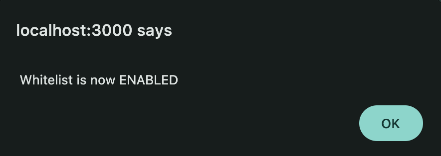

# Whitelist Feature Implementation

## Overview

The DAPPU Crowdsale application includes a comprehensive whitelist feature that allows the contract owner to restrict token purchases to approved addresses only. This provides greater control over who can participate in the token sale, which is useful for private sales, regulatory compliance, or staged rollouts.

## Features

- **Toggle Whitelist**: Enable or disable the whitelist restriction
- **Add/Remove Addresses**: Manage which addresses are allowed to purchase tokens
- **Status Indicator**: Clear visual indication of whether whitelist is enabled
- **Status Check**: Users can check if their address is whitelisted
- **Admin Panel**: Owner-only interface for whitelist management

## Smart Contract Implementation

The whitelist functionality is implemented in the Crowdsale.sol contract:

```solidity
// Whitelist mapping and array
mapping(address => bool) public whitelist;
address[] private allAddresses;
bool public whitelistEnabled = true;

// Modifier to check if buyer is whitelisted when required
modifier checkWhitelist(address _buyer) {
    if (whitelistEnabled) {
        require(whitelist[_buyer], "Address not whitelisted");
    }
    _;
}

// Function to toggle whitelist on/off
function toggleWhitelist(bool _enabled) public onlyOwner {
    whitelistEnabled = _enabled;
}

// Function to add an address to the whitelist
function addToWhitelist(address _address) public onlyOwner {
    if (!whitelist[_address]) {
        allAddresses.push(_address);
    }
    whitelist[_address] = true;
}

// Function to remove an address from the whitelist
function removeFromWhitelist(address _address) public onlyOwner {
    whitelist[_address] = false;
}

// Function to get all whitelisted addresses
function getWhitelistedAddresses() public view returns (address[] memory) {
    return allAddresses;
}

// Apply whitelist check to buyTokens function
function buyTokens() public payable checkWhitelist(msg.sender) {
    // Token purchase logic
}
```

## Frontend Implementation

### Admin Panel

The Admin.js component provides the contract owner with tools to manage the whitelist:

```jsx
const Admin = ({ provider, crowdsale, setIsLoading, whitelistStatus, setWhitelistStatus, darkMode }) => {
  const [address, setAddress] = useState('');
  const [whitelistedAddresses, setWhitelistedAddresses] = useState([]);
  const [isWhitelistEnabled, setIsWhitelistEnabled] = useState(whitelistStatus);

  // Toggle whitelist status
  const toggleWhitelistHandler = async () => {
    try {
      const signer = await provider.getSigner();
      const transaction = await crowdsale.connect(signer).toggleWhitelist(!isWhitelistEnabled);
      await transaction.wait();
      setIsWhitelistEnabled(!isWhitelistEnabled);
      setWhitelistStatus(!isWhitelistEnabled);
    } catch (error) {
      console.error("Toggle whitelist error:", error);
    }
  };

  // Add address to whitelist
  const addToWhitelistHandler = async () => {
    try {
      const signer = await provider.getSigner();
      const transaction = await crowdsale.connect(signer).addToWhitelist(address);
      await transaction.wait();
      fetchWhitelistedAddresses();
    } catch (error) {
      console.error("Add to whitelist error:", error);
    }
  };

  // Remove address from whitelist
  const removeFromWhitelistHandler = async () => {
    try {
      const signer = await provider.getSigner();
      const transaction = await crowdsale.connect(signer).removeFromWhitelist(address);
      await transaction.wait();
      fetchWhitelistedAddresses();
    } catch (error) {
      console.error("Remove from whitelist error:", error);
    }
  };

  // Fetch all whitelisted addresses
  const fetchWhitelistedAddresses = async () => {
    try {
      const addresses = await crowdsale.getWhitelistedAddresses();
      const uniqueAddresses = [...new Set(addresses)];
      setWhitelistedAddresses(uniqueAddresses);
    } catch (error) {
      console.error("Error fetching whitelisted addresses:", error);
    }
  };

  // UI rendering
  return (
    <Card className="my-4" bg={darkMode ? "dark" : "light"} text={darkMode ? "white" : "dark"}>
      <Card.Header>Admin Panel - Whitelist Management</Card.Header>
      
      <div className={`text-center py-2 ${isWhitelistEnabled ? 'bg-warning text-black' : 'bg-success text-white'}`}>
        <strong>Current Status:</strong> {isWhitelistEnabled ? 
          'Whitelist ENABLED - Only whitelisted addresses can buy tokens' : 
          'Whitelist DISABLED - Anyone can buy tokens'}
      </div>
      
      <Card.Body>
        {/* Address input form */}
        {/* Toggle whitelist button */}
        {/* Whitelisted addresses list */}
      </Card.Body>
    </Card>
  );
};
```

### User Status Check

Users can check if they're whitelisted via a modal:

```jsx
const checkWhitelistStatus = async () => {
  try {
    const signer = await provider.getSigner();
    const address = await signer.getAddress();
    const isWhitelisted = await crowdsale.whitelist(address);
    setShowWhitelistCheckModal(true);
    setWhitelistCheckResult({
      address: address,
      isWhitelisted: isWhitelisted,
      whitelistEnabled: whitelistEnabled
    });
  } catch (error) {
    console.error("Error checking whitelist status:", error);
  }
};
```

## Status Indicators

The application provides clear visual indicators of whitelist status:

1. **Global Status Banner**: Shows whether whitelist is enabled or disabled
2. **User Status Check**: Modal showing if the current user is whitelisted
3. **Admin Panel Status**: Color-coded status in the admin panel

## Screenshots

<p align="center">
  <big><strong>Admin Panel for Whitelist Management:</strong></big></p>
<p align="center"><small> ( appears below public status indicator & check button ) </small></p>
<p align="center">
  <table border="0" cellspacing="0" cellpadding="10">
    <tr>
      <td align="center">
        
        <p>Whitelist <strong><big><span style="color: #28a745;">IS</span></big></strong> active <em>( <span style="color: #28a745;">enabled</span> ) </em>✅</p>
          <p><strong>
          Toggle to Disable</strong></p>
            <p><strong><big>↓</big></strong></p>
      </td>
      <td align="center">
        
        <p>Whitelist is <strong><span style="color: #dc3545;">NOT</span></strong> active <em>( <span style="color: #dc3545;">disabled</span> ) </em>❌</p>
          <p><strong>
          Toggle to Enable</strong></p>
            <p><strong><big>↓</big></strong></p>
      </td>
    </tr>
  </table>
<p align="center">
  <table border="0" cellspacing="0" cellpadding="10">
    <tr>
      <td align="center">
        
        <p><em>alert:&nbsp;</em><strong><big><span style="color: #dc3545;">DISABLED</span></big></strong><p>
      </td>
      <!-- Add spacing between columns -->
        <td width="111"></td>
      <td align="center">
        
        <p><em>alert:&nbsp;</em><strong><big><span style="color: #28a745;">ENABLED</span></big></strong><p>
      </td>
    </tr>
  </table>
</p>
</br></br>
<p align="center">
  <strong>Not a whitelisted address?:</strong></p>
<p align="center"><strong><big>↓</big></strong></p>
<p align="center">
  <table border="0" cellspacing="0" cellpadding="10">
    <tr>
      <td align="center">
        
        <p><em>alert:&nbsp;</em> User <strong><big>NOT</big></strong> Whitelisted</p>
      </td>
    </tr>
  </table>
<p align="center"></p>
</br>
</hr>

## Best Practices

1. **Clear Visual Feedback**: Color-coded status indicators
2. **User-Friendly Messages**: Clear explanations of what whitelist status means
3. **Error Handling**: Comprehensive error handling for all whitelist operations
4. **Duplicate Prevention**: Filtering to prevent duplicate addresses in the UI
5. **Owner-Only Access**: Restricting whitelist management to the contract owner

## Future Enhancements? 😜

- **Merkle Proof Whitelist Implementation**: Replace the current mapping-based whitelist with a Merkle proof verification system. This would significantly reduce gas costs for large whitelists since only the Merkle root needs to be stored on-chain rather than every individual address. Users would provide a proof along with their transaction to verify their inclusion in the whitelist. This approach is particularly beneficial for projects with thousands of whitelisted addresses, as it shifts the storage burden off-chain while maintaining security and verifiability.

- **Batch Upload of Whitelisted Addresses**: Allow the admin to upload multiple addresses at once via CSV or JSON file, saving time when managing large whitelists.

- **Export/Import Whitelist Functionality**: Enable exporting the current whitelist to a file and importing from previously saved files, making it easier to transfer whitelist data between environments or create backups.

- **Timed Whitelist Periods**: Implement automatic enabling/disabling of the whitelist based on predefined time periods, useful for scheduling different phases of a token sale (e.g., private sale, pre-sale, public sale).

- **Tiered Whitelisting**: Create different tiers of whitelisted addresses with varying purchase limits or discount rates, allowing for more sophisticated token distribution strategies.

- **Whitelist Request System**: Add a user interface for non-whitelisted users to apply for whitelist status, with admin approval workflow, reducing the manual effort of collecting addresses through external channels.

- **Whitelist Analytics**: Provide statistics and insights about whitelist usage, such as number of whitelisted addresses, token purchase rates among whitelisted users, and geographic distribution (if KYC data is available).

- **Whitelist Notifications**: Send email or on-chain notifications to users when they are added to or removed from the whitelist, improving communication and user experience.